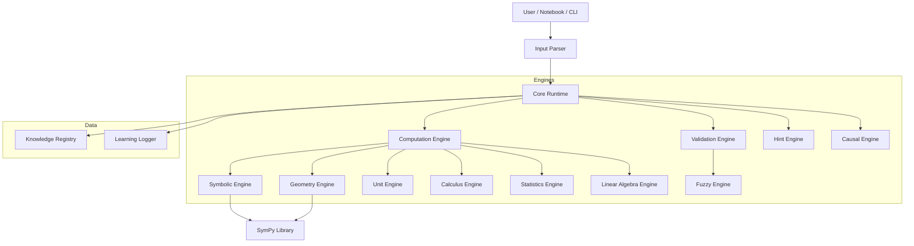

# CausalScript 開発状況レポート

## 1. 実装済み機能 (現在のステータス)

現在のCausalScriptコードベースは、代数操作とプロセス分析に焦点を当てた、ステップバイステップの数学的問題解決のための堅牢なコアを実装しています。

### コアアーキテクチャ
- **DSL Parser (v2.5)**: 数学の問題、ステップ、説明を定義するための行指向のドメイン固有言語（DSL）をサポートしています。
- **Core Runtime**: DSLの実行を指揮し、状態とフローを管理します。
- **Evaluator**: コンテキストを維持しながら、数学的表現をステップバイステップで評価します。

### エンジン群
- **Symbolic Engine**: `SymPy` のラッパー（`SimpleAlgebra` へのフォールバック付き）で、代数操作を処理します。
- **Computation Engine**: ランタイムとシンボリックエンジンの橋渡しをする、数学的計算のための高レベルインターフェースです。
- **Geometry Engine (New)**: 2Dおよび3D幾何学演算をサポートします。
    - **2D**: 点、線、円、多角形などのプリミティブと、面積、距離、定理検証（三平方、合同、相似など）。
    - **3D**: 角柱、角錐、円柱、円錐、球などの立体と、体積、表面積の計算。
- **Statistics Engine (New)**: 記述統計、確率分布、データの可視化をサポートします。
- **Calculus Engine (New)**: 微分、積分、接線の傾き、曲線下の面積を計算します。
- **Linear Algebra Engine (New)**: ベクトル・行列演算、連立一次方程式の解法、固有値・固有ベクトル計算をサポートします。
- **Trigonometry Helper (New)**: 三角関数の評価、恒等式の適用、単位円の計算をサポートします。
- **Function Analyzer (New)**: 関数の定義域、値域、切片、挙動分析、プロットデータ生成を行います。
- **Causal Engine**: 問題解決プロセスの因果推論（エラートレーシング、反事実シミュレーション）を行います。
- **Validation Engine**: 各ステップの論理的整合性を検証します。
- **Hint Engine**: エラーの種類（符号ミス、定数ズレなど）に基づいてヒントを生成します。
- **Unit Engine**: 物理単位の解析と変換を処理します。
- **Fuzzy Engine**: ファジーマッチングによる柔軟な回答チェックを提供します。

### インターフェース
- **CLI**: `.cs` ファイルの実行とテスト。
- **Notebook Integration**: Jupyter Notebookでの実行サポート。

---

## 2. Coreアーキテクチャ能力評価

Coreアーキテクチャがコンセプト通りの能力を持っているかを評価しました。

| 能力 | 評価 | 詳細 |
| :--- | :---: | :--- |
| **人間の書いた数式を理解する** | ✅ 実装済 | `CoreRuntime` および `InputParser` が、方程式（`2x + 5 = 15`）や自然な表記（`^`）を解析し、内部的にシンボリック表現に変換して処理します。 |
| **Step-by-step 評価** | ✅ 実装済 | `CoreRuntime` が各ステップごとに `check_step` を実行し、前の状態との論理的等価性を検証します。方程式の変形もサポートしています。 |
| **ヒント生成** | ✅ 実装済 | `HintEngine` が実装されており、ステップ検証失敗時にヒューリスティック（符号ミス、定数差）やパターンマッチングを用いて具体的なヒントを生成します。 |
| **並列計算** | ✅ 実装済 | `ComputationEngine` が `ProcessPoolExecutor` を使用して、CPUバウンドなタスク（シナリオ評価など）をプロセスベースで並列実行し、高速化を実現しています。 |
| **LaTeX 出力** | ✅ 実装済 | `SymbolicEngine` および `ComputationEngine` が `to_latex` メソッドを提供し、数式の美しいレンダリング用データを生成します。 |
| **グラフィカルデータ出力** | ✅ 実装済 | `GeometryEngine` や `FunctionAnalyzer` が、UIレンダリング用に標準化された辞書形式（JSON互換）で図形やプロットデータを出力します。 |

---

## 3. アーキテクチャ構成図

現在のCausalScript Coreの構成図です。`CoreRuntime` が各エンジンをオーケストレーションしています。

---

## 4. 計算可能な分野 (現在の能力)

- **算数・計算**: 四則演算、分数、小数。
- **初等代数**: 多項式、方程式、不等式。
- **幾何学 (2D/3D)**:
    - 平面図形（面積、距離、合同・相似証明など）
    - 空間図形（体積、表面積）
- **統計と確率**: 記述統計、確率分布、ヒストグラム。
- **解析学**:
    - 関数分析（定義域、値域、漸近線）
    - 微積分（極限、微分、積分）
- **線形代数**: ベクトル、行列、連立方程式、固有値。
- **物理単位**: 次元解析、単位変換。

---

## 5. V1.0（中高数学）に向けた不足分野

- **高度な可視化**: プロットデータや図形データの生成機能は実装済み。レンダリングはクライアント（UI/Frontend）に委譲する設計として確立されました。
- **複雑な証明問題**: 幾何学の証明生成など、より高度な推論能力。
