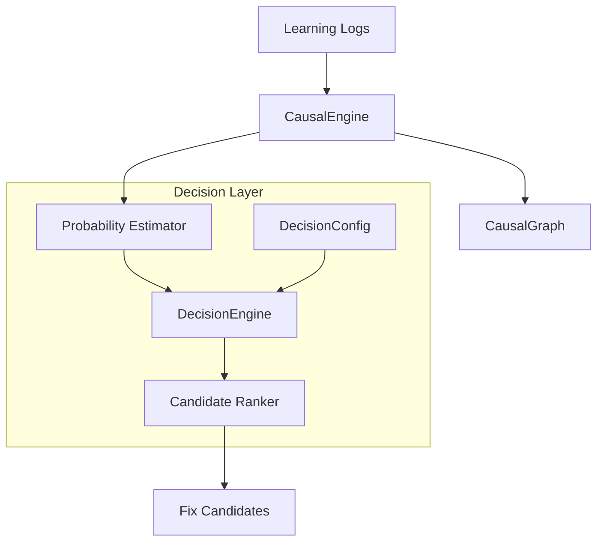

# Coherent 因果推論エンジン拡張設計書 (v1.1)

## テーマ: 意思決定論に基づく適応的エラー診断システム

### 1. 目的と背景
現在の CausalEngine は、エラーノードからの単純なグラフ探索（祖先ノードの列挙）によって原因候補を特定している。しかし、候補の順位付けは「ステップ優先・新しい順」という固定的なヒューリスティックに依存しており、学習者の習熟度や教育的意図（自信をつけさせるか、厳しく指導するか）を反映できていない。

本設計では、`core/decision_theory.py` の意思決定エンジンを因果推論プロセスに組み込み、「確率（原因である可能性）」と「効用（教育的価値）」のバランスに基づいた最適な修正候補の提案を実現する。

### 2. アーキテクチャ概要

#### 2.1 統合アプローチ
CausalEngine 内部に DecisionEngine インスタンスを保持させ、`suggest_fix_candidates` メソッドなどの意思決定ポイントでこれを呼び出す「包含（Composition）」パターンを採用する。



#### 2.2 コンポーネント定義
1.  **Probability Estimator (確率推定器)**
    *   あるノード（ステップまたはルール）がエラーの「真の原因」である確率 $P(Cause|Node)$ を推定する。
    *   現フェーズではグラフ構造に基づくヒューリスティックを使用（エラーに近いほど高確率、など）。

2.  **Educational Utility Matrix (教育的効用行列)**
    *   そのノードを指摘することが学習者にとってどれだけの価値（Utility）があるかを定義する。
    *   例：「単純な計算ミス（修正容易）」vs「ルールの誤適用（概念理解に重要）」

3.  **Candidate Ranker (候補ランカー)**
    *   期待効用 $EU = P \times U(Success) + (1-P) \times U(Failure)$ に基づき候補をソートする。

### 3. 詳細設計

#### 3.1 データ構造の拡張
`core/decision_theory.py` の `DecisionState` を因果推論用に解釈拡張する。

*   **State (状態)**
    *   `MATCH` (1): 「このノードが真のエラー原因である」
    *   `MISMATCH` (-1): 「このノードはエラー原因ではない（修正しても直らない）」

*   **Action (行動)**
    *   `ACCEPT`: 「このノードを修正候補として提示する」
    *   `REJECT`: 「このノードは候補から除外する」
    *   `REVIEW`: 「保留（優先度を下げる、またはヒントのみ出す）」

#### 3.2 効用行列（Utility Matrix）の定義
学習者のペルソナ（戦略）に応じて行列を切り替えることで、振る舞いを変化させる。

*   **戦略A: encouraging (初心者向け・自信付与)**
    *   「確実に修正できる直近のミス」を優先し、誤検知（冤罪指摘）による混乱を避ける。
    *   Accept / Match (正解指摘): +100 (高い効用)
    *   Accept / Mismatch (冤罪指摘): -100 (高いペナルティ)
    *   Reject / Match (見逃し): -10 (低いペナルティ)

*   **戦略B: strict (上級者向け・根本理解)**
    *   可能性が低くても、上流にある「ルールの誤用」などの根本原因を積極的に疑う。
    *   Accept / Match (正解指摘): +150 (非常に高い効用)
    *   Accept / Mismatch (冤罪指摘): -20 (許容する)
    *   Reject / Match (見逃し): -100 (根本原因の見逃しは許さない)

#### 3.3 アルゴリズム：suggest_fix_candidates の刷新
現在のヒューリスティックロジックを以下のように変更する。

1.  **候補収集**: `why_error(error_id)` で原因候補となる祖先ノードリストを取得。
2.  **確率割当**: 各ノード $n$ に対して原因確率 $P(n)$ を計算。
    *   $P(n) = \alpha \cdot \frac{1}{distance(n, error)} + \beta \cdot (1 \text{ if } type(n)==RULE \text{ else } 0)$
    *   （近いノードほど確率が高く、ルールノードに重みを置く等の簡易計算）
3.  **意思決定**: 各ノードについて `DecisionEngine.decide(P(n))` を実行。
    *   戻り値: `(Action, ExpectedUtility)`
4.  **フィルタリング & ソート**:
    *   `Action == REJECT` のノードを除外。
    *   残ったノードを `ExpectedUtility` の降順でソート。
5.  **出力**: 上位 $k$ 件を返す。

### 4. 実装計画

#### 4.1 修正対象ファイル
*   `core/causal/causal_engine.py`: `CausalEngine` クラスの改修。
*   `core/causal/causal_analyzers.py`: 確率計算ロジック（ヘルパー関数）の追加（今回は `CausalEngine` 内メソッドとして実装）。

#### 4.2 CausalEngine 拡張案 (Python)

```python
from typing import List, Tuple
from core.decision_theory import DecisionEngine, DecisionConfig, DecisionAction
from core.causal.causal_types import CausalNode, CausalNodeType

class CausalEngine:
    def __init__(self, decision_config: DecisionConfig = None) -> None:
        self.graph = CausalGraph()
        # デフォルトは balanced 戦略
        self.decision_engine = DecisionEngine(decision_config or DecisionConfig(strategy="balanced"))
        self.reset()

    def _calculate_cause_probability(self, node: CausalNode, distance: int) -> float:
        """
        ノードが原因である確率をヒューリスティックに計算する。
        距離が近いほど高く、STEPよりもRULEの方が根本原因である可能性を考慮（仮）。
        """
        base_prob = 1.0 / (distance + 1)  # 距離減衰
        
        # ルール適用ノードには重み付け（設定次第）
        if node.node_type == CausalNodeType.RULE_APPLICATION:
            base_prob *= 1.2
            
        return min(1.0, base_prob)

    def suggest_fix_candidates(self, error_node_id: str, limit: int = 3) -> List[CausalNode]:
        # 1. 候補収集（既存のwhy_error利用）
        raw_candidates = self.why_error(error_node_id)
        
        scored_candidates: List[Tuple[float, CausalNode]] = []

        for idx, node in enumerate(raw_candidates):
            # 2. 確率推定 (idx=0 が最も近い＝距離小)
            distance = idx + 1
            prob = self._calculate_cause_probability(node, distance)
            
            # 3. 意思決定
            action, utility, _ = self.decision_engine.decide(prob)
            
            # 4. REJECT 除外 & 効用記録
            if action != DecisionAction.REJECT:
                scored_candidates.append((utility, node))
        
        # 5. 効用順にソート
        scored_candidates.sort(key=lambda x: x[0], reverse=True)
        
        return [node for _, node in scored_candidates[:limit]]
```

### 5. 検証・テスト方針

#### 5.1 シナリオテスト
以下のシナリオを用いて、戦略（Strategy）による挙動の変化を確認する。
*   入力: `problem: 1+1`, `step: 3` (単純ミス), `end: done`
*   期待値:
    *   `strategy="encouraging"`: 直近の `step: 3` が最上位に来る（修正容易性優先）。
    *   `strategy="strict"`: もしルール適用ミスがあれば、より上流のルールノードが上位に来る可能性がある（根本原因優先）。

#### 5.2 ユニットテスト
`tests/test_causal_decision.py` を新規作成。
確率 $P=0.1, 0.5, 0.9$ のノードに対し、各戦略（UtilityMatrix）で適切な順位付けが行われるかを検証。
